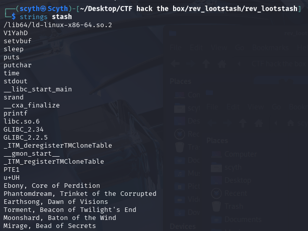

Name: LootStash
Type: Reversing CTF
Time taken: ~2hr

Downloaded the files from CTF.

Unzipped the file: 
File -> Stash
Stash was of ELF type.

Created a new project in Ghidra and and opened the file using the CodeBrowser and analysed it:

In CodeBrowser goto Symbol Tree -> Functions -> main
This will open up the decompiled main function.

Here we can see that the program is actually fluff that just prints 5 dots(.) in 1 second interval

This is where our focus should be. It says that whatever the flag is, it has to be a string and it is stored in gear array.
But instead of searching through the array, its easier to directly find the string value in the file.

We can try executing the file but it shows "Permission Denied"
So we have another option since we require a string, we can just use "strings" since it's a ELF file.

Run : strings stash
It returns all the string values in the stash file.

Continuing upon this we can search for a specific FLAG.

Run: strings stash | grep HTB
It provides us with the FLAG.

FLAG: HTB{n33dl3_1n_a_l00t_stack}